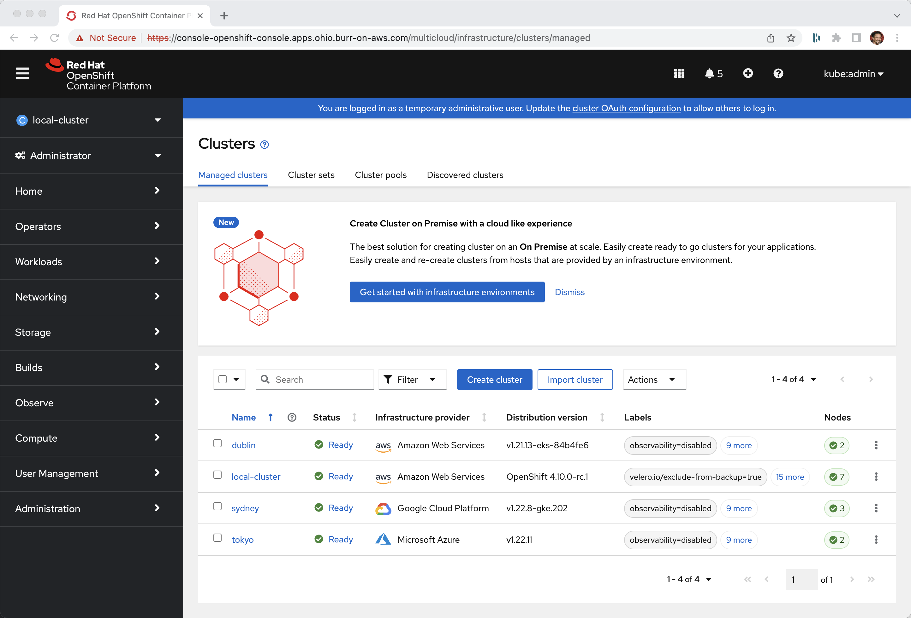
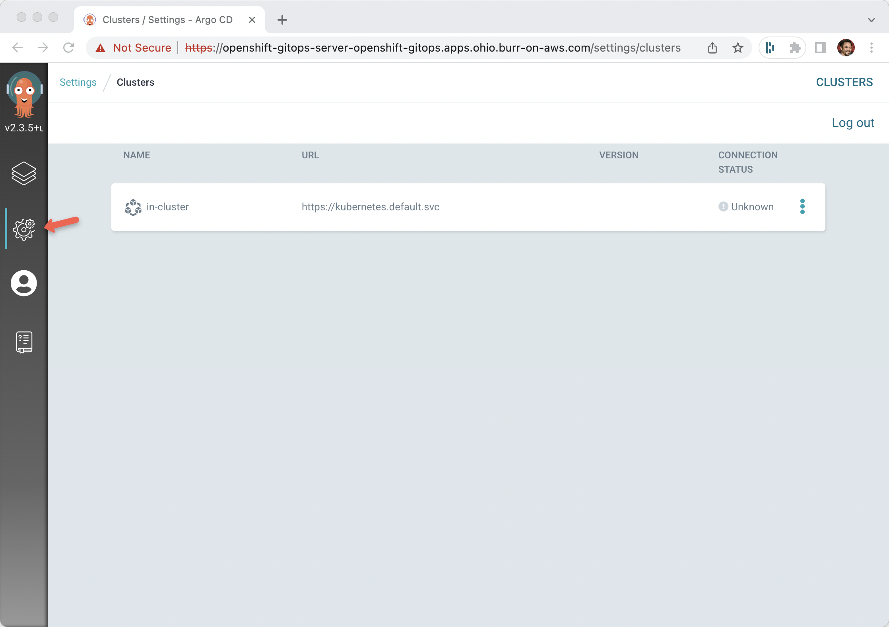
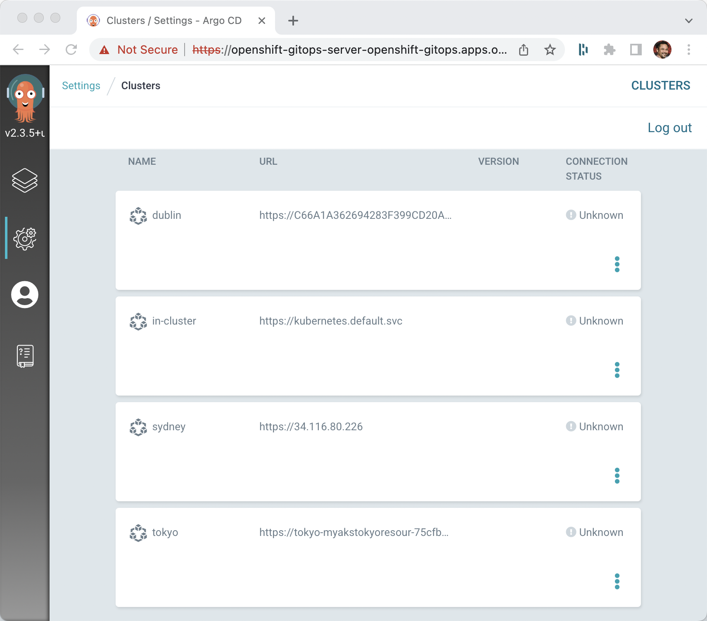
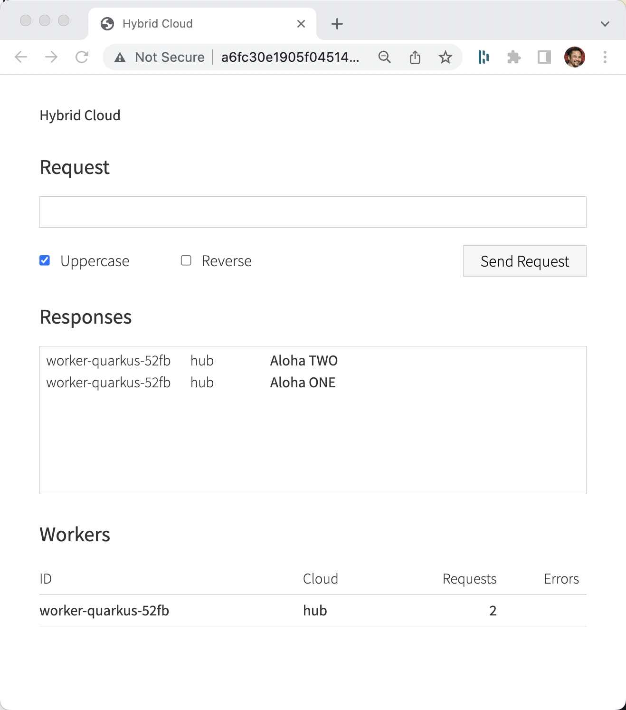

# AKS, EKS, GKE, OpenShift + ACM Hub + ArgoCD

4 clusters

OpenShift with ACM Hub and OpenShift Gitops (aka ArgoCD)

EKS - 

AKS -

GKE - Sydney

Delivery of Skupper via ArgoCD

Delivery of a Skupper ready demo app via ArgoCD


## Azure AKS Tokyo

```
az --version
azure-cli                         2.37.0 *

core                              2.37.0 *
telemetry                          1.0.6
```

```
export KUBECONFIG=/Users/burr/xKS/.kubeconfig/aks-tokyo-config

az login

az group create --name myAKSTokyoResourceGroup --location japaneast

az aks create --resource-group myAKSTokyoResourceGroup --name tokyo -s Standard_DS3_v2 --node-count 2
```

```
az aks get-credentials --resource-group myAKSTokyoResourceGroup --name tokyo --file $KUBECONFIG
```

```
kubectl cluster-info
Kubernetes control plane is running at https://tokyo-myakstokyoresour-75cfbc-8a30ee5c.hcp.japaneast.azmk8s.io:443
CoreDNS is running at https://tokyo-myakstokyoresour-75cfbc-8a30ee5c.hcp.japaneast.azmk8s.io:443/api/v1/namespaces/kube-system/services/kube-dns:dns/proxy
Metrics-server is running at https://tokyo-myakstokyoresour-75cfbc-8a30ee5c.hcp.japaneast.azmk8s.io:443/api/v1/namespaces/kube-system/services/https:metrics-server:/proxy
```

```
kubectl get nodes
NAME                                STATUS   ROLES   AGE    VERSION
aks-nodepool1-21111621-vmss000000   Ready    agent   2m4s   v1.22.11
aks-nodepool1-21111621-vmss000001   Ready    agent   2m4s   v1.22.11
```


## Amazon EKS Dublin

```
aws --version
aws-cli/2.7.7 Python/3.9.13 Darwin/21.5.0 source/arm64 prompt/off

eksctl version
0.92.0
```

```
export KUBECONFIG=/Users/burr/xKS/.kubeconfig/eks-dublin-config

eksctl create cluster \
--name dublin \
--region eu-west-1 \
--nodegroup-name myEKSworkers \
--instance-types=m6i.xlarge \
--nodes 2 \
--managed
```

```
eksctl utils write-kubeconfig --cluster=dublin --region eu-west-1
aws eks update-kubeconfig --name dublin --region eu-west-1
```

```
kubectl cluster-info
Kubernetes control plane is running at https://C66A1A362694283F399CD20AB42FB42C.gr7.eu-west-1.eks.amazonaws.com
CoreDNS is running at https://C66A1A362694283F399CD20AB42FB42C.gr7.eu-west-1.eks.amazonaws.com/api/v1/namespaces/kube-system/services/kube-dns:dns/proxy
```

```
kubectl get nodes
NAME                                           STATUS   ROLES    AGE    VERSION
ip-192-168-13-254.eu-west-1.compute.internal   Ready    <none>   3m3s   v1.21.12-eks-5308cf7
ip-192-168-80-7.eu-west-1.compute.internal     Ready    <none>   3m3s   v1.21.12-eks-5308cf7
```

## Google GKE Sydney

```
export KUBECONFIG=/Users/burr/xKS/.kubeconfig/gke-sydney-config

gcloud container clusters create sydney --region australia-southeast1 --machine-type=e2-standard-4 --num-nodes 1
# num-nodes is per zone in GKE land, this becomes a 3 node cluster
```

```
# To address the following warning
# WARNING: the gcp auth plugin is deprecated in v1.22+, unavailable in v1.25+; use gcloud instead.
# To learn more, consult https://cloud.google.com/blog/products/containers-kubernetes/kubectl-auth-changes-in-gke

export PATH=/System/Volumes/Data/opt/homebrew/Caskroom/google-cloud-sdk/latest/google-cloud-sdk/bin/:$PATH
export USE_GKE_GCLOUD_AUTH_PLUGIN=True
gcloud container clusters get-credentials sydney --region australia-southeast1
```

```
kubectl cluster-info
Kubernetes control plane is running at https://34.116.80.226
GLBCDefaultBackend is running at https://34.116.80.226/api/v1/namespaces/kube-system/services/default-http-backend:http/proxy
KubeDNS is running at https://34.116.80.226/api/v1/namespaces/kube-system/services/kube-dns:dns/proxy
Metrics-server is running at https://34.116.80.226/api/v1/namespaces/kube-system/services/https:metrics-server:/proxy
```

```
kubectl get nodes
NAME                                    STATUS   ROLES    AGE     VERSION
gke-sydney-default-pool-23828bfb-2hfp   Ready    <none>   7m22s   v1.22.8-gke.202
gke-sydney-default-pool-6783d5e9-vlbx   Ready    <none>   7m23s   v1.22.8-gke.202
gke-sydney-default-pool-9e2432ca-w9kb   Ready    <none>   7m23s   v1.22.8-gke.202
```

## Import in ACM Hub

Assumes you have an OCP + ACM Operator + GitOps Operator

https://github.com/burrsutter/acm-argocd-acs

Download pull secret from https://console.redhat.com/openshift/install/pull-secret

### Hub

```
oc project open-cluster-management
```

Assumes you downloaded the pull-secret.txt into $HOME/Downloads - default for most browsers

```
kubectl create secret generic mypullsecret -n open-cluster-management --from-file=.dockerconfigjson=$HOME/Downloads/pull-secret.txt --type=kubernetes.io/dockerconfigjson
```

Update the MCH

```
cat <<EOF | kubectl apply -f -
apiVersion: operator.open-cluster-management.io/v1
kind: MultiClusterHub
metadata:
  name: multiclusterhub
  namespace: open-cluster-management
spec:
  imagePullSecret: mypullsecret
EOF
```

#### Generate Tokyo files

```
./import-hub.sh tokyo
```

This will generate the following files to be applied to the Hub (management cluster):

managedcluster-tokyo.yaml

kac-tokyo.yaml

And two files to be applied to the Spoke (imported/managed cluster):

$HOME/tokyo-klusterlet-crd.yaml

$HOME/tokyo-import.yaml

#### Generate Dublin files

```
./import-hub.sh dublin
```

This will generate the following files to be applied to the Hub (management cluster):

managedcluster-dublin.yaml

kac-dublin.yaml

And two files to be applied to the Spoke (imported/managed cluster):

$HOME/dublin-klusterlet-crd.yaml

$HOME/dublin-import.yaml


#### Generate Sydney files

```
./import-hub.sh sydney
```

This will generate the following files to be applied to the Hub (management cluster):

managedcluster-sydney.yaml

kac-sydney.yaml

And two files to be applied to the Spoke (imported/managed cluster):

$HOME/sydney-klusterlet-crd.yaml

$HOME/sydney-import.yaml


### Tokyo

```
echo $KUBECONFIG
/Users/burr/xKS/.kubeconfig/aks-tokyo-config
```

```
kubectl get nodes
NAME                                STATUS   ROLES   AGE   VERSION
aks-nodepool1-21111621-vmss000000   Ready    agent   86m   v1.22.11
aks-nodepool1-21111621-vmss000001   Ready    agent   86m   v1.22.11
```

```
./import-spoke.sh tokyo
```

### Dublin

```
echo $KUBECONFIG
/Users/burr/xKS/.kubeconfig/eks-dublin-config
```

```
kubectl get nodes
NAME                                STATUS   ROLES   AGE   VERSION
aks-nodepool1-21111621-vmss000000   Ready    agent   86m   v1.22.11
aks-nodepool1-21111621-vmss000001   Ready    agent   86m   v1.22.11
```

```
./import-spoke.sh dublin
```


### Sydney

```
echo $KUBECONFIG
/Users/burr/xKS/.kubeconfig/gke-sydney-config
```

```
kubectl get nodes
NAME                                    STATUS   ROLES    AGE   VERSION
gke-sydney-default-pool-23828bfb-2hfp   Ready    <none>   40m   v1.22.8-gke.202
gke-sydney-default-pool-6783d5e9-vlbx   Ready    <none>   40m   v1.22.8-gke.202
gke-sydney-default-pool-9e2432ca-w9kb   Ready    <none>   40m   v1.22.8-gke.202
```

```
./import-spoke.sh sydney
```



## ArgoCD Managed Clusters

This uses OpenShift Gitops NOT upstream ArgoCD.  Primary difference seems to be the namespace "openshift-gitops" vs "argocd".

### Hub
```
export ARGOCD_URL=$(kubectl get route openshift-gitops-server -n openshift-gitops -o jsonpath="{.status.ingress[0].host}")
echo $ARGOCD_URL
```

```
export ARGOCD_PASS=$(kubectl get secret/openshift-gitops-cluster -n openshift-gitops -o jsonpath='{.data.admin\.password}' | base64 -d)
echo $ARGOCD_PASS
```

```
argocd login --insecure --grpc-web $ARGOCD_URL --username admin --password $ARGOCD_PASS
```

```
argocd cluster list
SERVER                          NAME        VERSION  STATUS   MESSAGE                                              PROJECT
https://kubernetes.default.svc  in-cluster           Unknown  Cluster has no application and not being monitored.
```

```
open http://$ARGOCD_URL
```

Use `admin` and the password found via `echo $ARGOCD_PASS`



### Hub Cluster Import

```
kubectl config get-contexts -o name
```

```
admin
default/api-ohio-burr-on-aws-com:6443/kube:admin
```

```
argocd cluster add --kubeconfig $KUBECONFIG default/api-ohio-burr-on-aws-com:6443/kube:admin --name hub
```

```
argocd cluster list
SERVER                                 NAME        VERSION  STATUS      MESSAGE                                              PROJECT
https://api.ohio.burr-on-aws.com:6443  hub         1.23     Successful
https://kubernetes.default.svc         in-cluster           Unknown     Cluster has no application and not being monitored.
```


### Tokyo ArgoCD Import

```
kubectl config get-contexts -o name
```

```
tokyo
```

```
argocd cluster add --kubeconfig $KUBECONFIG tokyo --name tokyo
```

output:

```
WARNING: This will create a service account `argocd-manager` on the cluster referenced by context `tokyo` with full cluster level admin privileges. Do you want to continue [y/N]? y
INFO[0011] ServiceAccount "argocd-manager" created in namespace "kube-system"
INFO[0012] ClusterRole "argocd-manager-role" created
INFO[0012] ClusterRoleBinding "argocd-manager-role-binding" created
Cluster 'https://tokyo-myakstokyoresour-75cfbc-8a30ee5c.hcp.japaneast.azmk8s.io:443' added
```

### Dublin ArgoCD Import

```
kubectl config get-contexts -o name
```

```
arn:aws:eks:eu-west-1:659615255973:cluster/dublin
```

```
argocd cluster add --kubeconfig $KUBECONFIG arn:aws:eks:eu-west-1:659615255973:cluster/dublin --name dublin
```

### Sydney ArgoCD Import

```
kubectl config get-contexts -o name
```

```
gke_ocp42project_australia-southeast1_sydney
```

```
argocd cluster add --kubeconfig $KUBECONFIG gke_ocp42project_australia-southeast1_sydney --name sydney
```

## Managed Clusters in ArgoCD

```
argocd cluster list
SERVER                                                                      NAME        VERSION  STATUS   MESSAGE                                              PROJECT
https://34.116.80.226                                                       sydney               Unknown  Cluster has no application and not being monitored.
https://C66A1A362694283F399CD20AB42FB42C.gr7.eu-west-1.eks.amazonaws.com    dublin               Unknown  Cluster has no application and not being monitored.
https://tokyo-myakstokyoresour-75cfbc-8a30ee5c.hcp.japaneast.azmk8s.io:443  tokyo                Unknown  Cluster has no application and not being monitored.
https://kubernetes.default.svc                                              in-cluster           Unknown  Cluster has no application and not being monitored.
```




### Hub for Skupper ApplicationSet

```
kubectl -n openshift-gitops apply -f applicationset-skupper.yaml
```

No Applications yet 

```
argocd app list
NAME  CLUSTER  NAMESPACE  PROJECT  STATUS  HEALTH  SYNCPOLICY  CONDITIONS  REPO  PATH  TARGET
```

```
kubectl get secrets -n openshift-gitops -l argocd.argoproj.io/secret-type=cluster
```

```
NAME                                                                                  TYPE     DATA   AGE
cluster-34.116.80.226-2385601495                                                      Opaque   3      73m
cluster-c66a1a362694283f399cd20ab42fb42c.gr7.eu-west-1.eks.amazonaws.com-3755022628   Opaque   3      74m
cluster-tokyo-myakstokyoresour-75cfbc-8a30ee5c.hcp.japaneast.azmk8s.io-7543449        Opaque   3      76m
```

Now add the magic label to the secrets

```
kubectl label secret env=production -n openshift-gitops -l argocd.argoproj.io/secret-type=cluster
```

```
argocd app list
```

```
NAME            CLUSTER                                                                     NAMESPACE  PROJECT  STATUS     HEALTH   SYNCPOLICY  CONDITIONS  REPO                                     PATH                            TARGET
skupper-dublin  https://C66A1A362694283F399CD20AB42FB42C.gr7.eu-west-1.eks.amazonaws.com    hybrid     default  OutOfSync  Missing  Auto-Prune  <none>      https://github.com/burrsutter/polycloud  argocd-skupper/overlays/dublin  main
skupper-sydney  https://34.116.80.226                                                       hybrid     default                      Auto-Prune  <none>      https://github.com/burrsutter/polycloud  argocd-skupper/overlays/sydney  main
skupper-tokyo   https://tokyo-myakstokyoresour-75cfbc-8a30ee5c.hcp.japaneast.azmk8s.io:443  hybrid     default  OutOfSync  Missing  Auto-Prune  <none>      https://github.com/burrsutter/polycloud  argocd-skupper/overlays/tokyo   main
```

```
NAME            CLUSTER                                                                     NAMESPACE  PROJECT  STATUS  HEALTH   SYNCPOLICY  CONDITIONS  REPO                                     PATH                            TARGET
skupper-dublin  https://C66A1A362694283F399CD20AB42FB42C.gr7.eu-west-1.eks.amazonaws.com    hybrid     default  Synced  Healthy  Auto-Prune  <none>      https://github.com/burrsutter/polycloud  argocd-skupper/overlays/dublin  main
skupper-sydney  https://34.116.80.226                                                       hybrid     default  Synced  Healthy  Auto-Prune  <none>      https://github.com/burrsutter/polycloud  argocd-skupper/overlays/sydney  main
skupper-tokyo   https://tokyo-myakstokyoresour-75cfbc-8a30ee5c.hcp.japaneast.azmk8s.io:443  hybrid     default  Synced  Healthy  Auto-Prune  <none>      https://github.com/burrsutter/polycloud  argocd-skupper/overlays/tokyo   main
```

### Tokyo

```
kubectl get pods -n hybrid
NAME                                         READY   STATUS    RESTARTS   AGE
skupper-router-74dc588d-x5ch8                2/2     Running   0          48s
skupper-service-controller-d57558bf4-9x5th   1/1     Running   0          26s
skupper-site-controller-56d886649c-7bb2s     1/1     Running   0          57s
```

### Dublin

```
kubectl get pods -n hybrid
NAME                                          READY   STATUS    RESTARTS   AGE
skupper-router-557c5f7-jfrk6                  2/2     Running   0          97s
skupper-service-controller-69b54f6d68-q8dvr   1/1     Running   0          93s
skupper-site-controller-56d886649c-xjgb2      1/1     Running   0          106s
```

### Sydney

```
kubectl get pods -n hybrid
NAME                                          READY   STATUS    RESTARTS   AGE
skupper-router-6566458c64-mqgd6               2/2     Running   0          2m4s
skupper-service-controller-84d4f64b6d-r5v56   1/1     Running   0          38s
skupper-site-controller-56d886649c-nsrz9      1/1     Running   0          2m12s
```


## Frontend deployed to Hub

```
kubectl apply -n openshift-gitops -f applicationset-frontend.yml
```

Add label to the appropriate secret, first find the right secret

```
kubectl get secrets -n openshift-gitops -l argocd.argoproj.io/secret-type=cluster --show-labels
```

```
NAME                                                                                TYPE     DATA   AGE   LABELS
cluster-api.ohio.burr-on-aws.com-362486352                                          Opaque   3      59m   argocd.argoproj.io/secret-type=cluster,env=production
cluster-tokyo-myakstokyoresour-75cfbc-7b81be80.hcp.japaneast.azmk8s.io-3166199456   Opaque   3      11m   argocd.argoproj.io/secret-type=cluster,env=production
```

Label the correct secret, replacing the secret name with that found on your current hub cluster

```
 kubectl -n openshift-gitops label secret cluster-api.ohio.burr-on-aws.com-362486352 frontend=gui
```

And frontend deploys out to the Hub's hybrid namespace

```
kubectl get pods -n hybrid
NAME                                          READY   STATUS    RESTARTS   AGE
hybrid-cloud-frontend-86db4b879b-p4qrf        1/1     Running   0          16s
skupper-router-5f7dc49dc7-lw5cj               2/2     Running   0          14m
skupper-service-controller-7ffb977f78-kbrv2   1/1     Running   0          14m
skupper-site-controller-855d8f9467-zm94l      1/1     Running   0          15m
```


### Backends

```
kubectl apply -n openshift-gitops -f applicationset-backend.yaml
```

Add labels

```
kubectl label secret backend=processor -n openshift-gitops -l argocd.argoproj.io/secret-type=cluster
```

And in all clusters you should find a pod and service called `backapi` 

```
kubectl get pods -n hybrid
NAME                                          READY   STATUS    RESTARTS   AGE
backapi-6ff86d5d88-sbtzw                      1/1     Running   0          93s
skupper-router-5745754cbc-gfc4z               2/2     Running   0          3h50m
skupper-service-controller-57b9b55cbd-d7pfj   1/1     Running   0          3h50m
skupper-site-controller-56d886649c-8sg2w      1/1     Running   0          3h50m
```

```
kubectl get services -n hybrid
NAME                     TYPE           CLUSTER-IP     EXTERNAL-IP    PORT(S)                           AGE
backapi                  ClusterIP      10.0.209.237   <none>         8080/TCP                          2m
skupper                  LoadBalancer   10.0.82.248    20.89.31.219   8080:30937/TCP,8081:30172/TCP     3h50m
skupper-router           LoadBalancer   10.0.149.118   20.89.30.222   55671:30796/TCP,45671:31628/TCP   3h51m
skupper-router-console   ClusterIP      10.0.125.227   <none>         8080/TCP                          3h51m
skupper-router-local     ClusterIP      10.0.191.19    <none>         5671/TCP                          3h51m
```

Testing frontend on the Hub with its "local" backapi service

AWS clusters's
```
export FRONTEND_URL=$(kubectl -n hybrid get services hybrid-cloud-frontend -o jsonpath='{.status.loadBalancer.ingress[0].hostname}'):8080
```

Non-AWS cluster's

```
export FRONTEND_URL=$(kubectl -n hybrid get services hybrid-cloud-frontend -o jsonpath='{.status.loadBalancer.ingress[0].ip}'):8080
```

```
open http://$FRONTEND_URL
```



## Link up Skuppers

Requires Skupper CLI https://skupper.io/install/index.html

On Hub


```
skupper -n hybrid token create token.yaml -t cert
```

```
skupper status
Skupper is enabled for namespace "hybrid" with site name "hub" in interior mode. It is not connected to any other sites. It has 1 exposed service.
The site console url is:  https://skupper-hybrid.apps.ohio.burr-on-aws.com
The credentials for internal console-auth mode are held in secret: 'skupper-console-users'
```

The exposed Service is due to a specific annotation on the backend Deployment https://github.com/burrsutter/polycloud/blob/main/argocd-backend/base/backend.yaml#L8


On each Spoke,

```
skupper -n hybrid link create token.yaml
```

```
skupper link status
```

```
Link link1 is active
```

##  Fail-over

On Hub,

```
curl $FRONTEND_URL/api/cloud
```

```
hub:0%
```

```
kubectl -n hybrid scale --replicas=0 deployment/backapi
```

```
curl $FRONTEND_URL/api/cloud
```

```
tokyo:0%
```

```
while true
do curl $FRONTEND_URL/api/cloud
echo ""
sleep .3
done
```

```
kubectl -n hybrid scale --replicas=1 deployment/backapi
```

```
tokyo:24
tokyo:25
tokyo:26
tokyo:27
hub:0
hub:1
hub:2
```


## Clean Up
```
az aks delete --resource-group myAKSTokyoResourceGroup --name tokyo
```

```
eksctl delete cluster --region=eu-west-1 --name=dublin
```

```
gcloud container clusters delete sydney --region australia-southeast1
```

```
openshift-install --dir=<config-dir> destroy cluster
```
